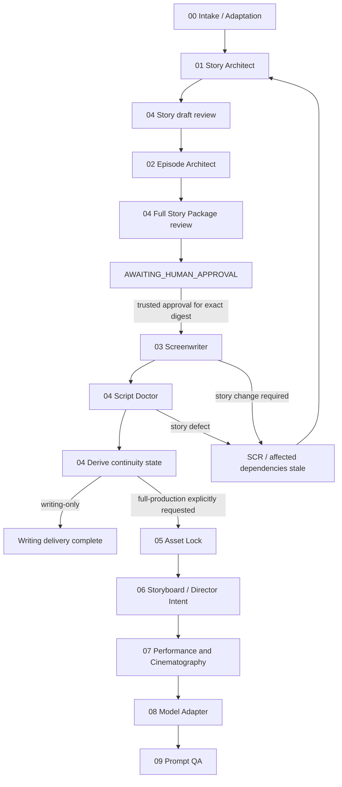

# USVDS V10 Architecture Audit

审计日期：2026-10-07。源代码基线：`67647579153fe73891ee2a6ce3ef1f92842ed9ca`。任务：`V10-00`；Owner：`/root/story_architecture_audit`；分支：`codex/v10-00-architecture-audit`。本文是架构与后续验收合同，不宣称 V10 已实现、已安装、已获得真实市场验证或已经合入 main。

后续实现记录（2026-10-07）：在 `core/usvd-v10/` 新增了 Intake/Adaptation、Story Architect、Episode Architect、Controller、Story Review 的初稿和 Project Brief / Story Package / Episode Entry / Review Report JSON Schema，并生成独立 GPT Agent Plugin 预览。它们状态为 `authored-unvalidated` 且 `runnable: false`；预览不包含 Screenwriter，也不解决 ND-001。此记录更新了可见范围，不改变下文架构决策与 Gate 验收合同。

后续插件集成记录（2026-10-07）：按用户新增要求，现有 ChatGPT 网页版个人插件 `us-vertical-drama-studio` 已保留原有八个 Skill，并叠加上述五个 V10 故事 Skill、入口判断说明、结构检查工具和示例，发布为 1.2.0。新增方向选择、现成大纲诊断、美国版冲突机制映射、主要转折因果链和独立审查。详见 [v10-reference-integration.md](v10-reference-integration.md)。此项交付变更覆盖了下文原始审计时“无打包/发布任务”的范围判断；不改变 ND-001 的阻断状态，也不代表 V10 DSH provider 或可信人工审批已经实现。

## 决策摘要

V10 应在独立 `core/usvd-v10/` 建立写作 Core：Intake / Adaptation → Story Architect → Episode Architect → 独立 Story Architecture Review → **绑定整份 Story Package revision/digest 的人工批准** → Screenwriter → 独立 Script Doctor → 派生 Continuity Ledger。默认交付范围为当前用户要求的 `writing-only`；通过单集审稿与连续性检查后结束，整季未审部分明示 `NOT ASSESSED`。

保留 V9 的 05 Asset Lock → 06 Storyboard Director → 07 Performance & Cinematography → 08 Seedance Adapter → 09 Prompt QA 边界，后续只在 V10 拥有的文件中继承。06/07 已经是独立于编剧和 Adapter 的导演层，当前无需再加一个拥有同样决定的“总导演”技能。无工作界面、外部媒体生成、压缩包、push 或发布任务。

两类 truth 必须区分：技能及契约的 authoring truth 是 V10 Core；某个创作项目的 Story Truth 是**唯一、已批准、不可原地改写的 Story Package JSON 修订**。Markdown 是它的生成阅读视图；Ledger 是从批准的 Story Package 与已审通过剧本推导的状态，不是第二套 Story Bible。

V10-01 首先证明 DSH 运行时能验证可信的人工来源、绑定内容摘要并拒绝过期下游产物；当前 ND-001 OPEN，硬 Gate 实施条件阻塞。现有模型切换 hook 不能证明这件事。若宿主不能提供可信 user-origin 审批和持久状态，只有具有独立可信人工输入通道的显式审批工具或外部可信状态存储才能满足硬 Gate；纯 Markdown 标签、模型提供的 `actor=human`、提示词中的 `APPROVED` 必须 fail closed。普通 agent-invocable 工具自报“用户批准”也不是可信审批工具。

## A. Current V9 Map：仓库真实状态

### A1. Core、Skill 与 Gate

权威目录为 `core/usvd-v9/`；`manifest.json` 的 `skill_order` 是 controller + 01–09，共 10 个。Core version 实际是 `0.9.0-preview.1`，01–04 Skill version 是 `2.1.0`，05 是 `2.0.1`，06–09 是 `0.2.0`。版本不同不代表存在多个 authoring truth。

| 真实 Skill 名称 / 目录 | 当前责任与输入 | 输出、Gate 与边界 |
| --- | --- | --- |
| `usvd-controller` / `skills/controller` | 检查现有材料与交付范围；只选择一个阶段 | 单一下一步；writing-only 在 `SCRIPT DOCTOR PASS + CONTINUITY CLEAR` 后停止；不代写业务产物 |
| `usvd-01-adaptation` / `01-adaptation` | 非美国来源 → 情绪承诺与社会逻辑改编；建立 US Project Contract | Adaptation Brief；文字 `APPROVED / NEEDS DECISION`；不写 Bible |
| `usvd-02-story-architecture` / `02-story-architecture` | 模式 A 为 Bible / Season / Arc；模式 B 为目标集 Beat Sheet；一次只做一种 | Bible 含角色/关系发动机、秘密、升级、承诺和 payoff window；A 批准后下次仍回 02；B 批准才交 03 |
| `usvd-03-screenwriter` / `03-screenwriter` | 批准 Bible + 本集 Beats + 连续性；兼容缺新式 Contract/Voice Card 的旧材料 | Screenplay Draft、Beat-to-scene Trace、时长估计、待批准变化；不得自审 PASS |
| `usvd-04-review-continuity` / `04-review-continuity` | 独立审稿；必须有实际 Draft 与批准正文，不接受用户预置分数替代证据 | `PASS / REWRITE / REJECT / BLOCKED`；100 分内部 craft 量表，85 分且无 mandatory fail 才 PASS；PASS 后 Continuity CLEAR 才更新 Ledger |
| `usvd-05-asset-lock` / `05-asset-lock` | 已审剧本 + Ledger；锁定 CHAR / LOOK / SET / PROP | Asset Creation Pack + Asset Ledger；所有必需资产批准才 `ASSETS LOCKED`；不拆镜头 |
| `usvd-v9-06-storyboard` / `06-storyboard` | 剧本、Beats、Bible、Ledger、锁定资产 | VIDEO/SHOT 覆盖、时序、粗导演意图、SHOT audio/events、状态；`STAGE 06 APPROVED`；不写最终模型 Prompt |
| `usvd-v9-07-performance-cinematography` / `07-performance-cinematography` | 已批准 06 + Ledger + 资产/声音事实 | 精化表演、blocking、构图、摄影、焦点、灯光、cut；`STAGE 07 APPROVED`；不改 06 时间、事件事实或资产 |
| `usvd-v9-08-seedance-2-mini-adapter` / `08-seedance-2-mini-adapter` | 06/07 + assets + verified endpoint profile | VIDEO master / negative + SHOT delta、执行归属和降级记录；`STAGE 08 READY FOR QA`；仅适配 Seedance 2.0 Mini，不重做导演 |
| `usvd-v9-09-prompt-qa` / `09-prompt-qa` | 06/07/08 + Ledgers + profile | 稳定 defect ID / ref / evidence / return stage；机器 QA 与人工清单共同决定 PASS；不静默改上游 |

现有 controller 的文字链路：

`BRIEF → ADAPTATION APPROVED → BIBLE APPROVED → BEATS APPROVED → SCRIPT DRAFT → SCRIPT DOCTOR PASS → CONTINUITY CLEAR → ASSETS LOCKED → 06 APPROVED → 07 APPROVED → 08 READY FOR QA → PROMPT QA PASS`。

原创美国 premise 可以直接进入 02，但仍要 US Project Contract。09 缺陷回拥有决定的 06/07/08/upstream，修复后重新过后续 Gate。原有控制器禁止默认并行/递归委派；09 只读 reviewer POC 是受控可选例外，不是默认创作架构。

### A2. Contracts 与真正的执行检查

`core/usvd-v9/contracts/` 实际只有四份 `stage-06-storyboard.json`、`stage-07-performance-cinematography.json`、`stage-08-seedance-2-mini-adapter.json`、`stage-09-prompt-qa.json`，版本均为 `v9-stage-0N-3`。它们是机器可读责任/字段规范，并非已为 01–04 提供完整 JSON Schema 和持久 Gate 数据模型。写作参考在 01/02 的 `references/us-writing-contract.md`、03/04 的 `references/us-writing-review.md`。

- `scripts/v9-director-validation.mjs`：VIDEO/SHOT 闭合、非法字段/类型等；SHOT 从 0 开始、无缝无重叠、总时长相等，容差 0.01s，15s 为上限而非补齐目标。
- `scripts/v9-seedance-adapter-validation.mjs`：目标模型、能力状态、外部执行 owner、master/delta、预算与 traceability。unknown 能力不能声称 native。
- `scripts/v9-prompt-qa-validation.mjs`：组合上述结构检查并定位源覆盖、资产、continuity、运镜/音频、事件执行、语言和过载缺陷；语义质量留给 `references/prompt-qa-human-checklist.md`。对白速率和字符预算是内部启发式，不是厂商能力或真实表演测量。
- 新声音事实在 SHOT 的 `dialogue / inner_voice / environment_sound / sfx / music_cue`，缺内容用空数组；每个 `shot_events` 有稳定事件 ID、源引用、时间、意图。VIDEO `dialogue_audio_plan` 只是只读兼容聚合。
- 08 默认 `inner_voice → external_voiceover`，不得自动转成可见人物口型。批准的声音文本原样保留；每个事件必须恰有一种执行归属。

### A3. DSH runtime、模型路由与历史 UI

`dsh-plugin/index.js` 从 `plugins/us-vertical-drama-studio-v9/manifest.json` 枚举并注册原生 `ctx.skills.registerProvider`，不硬编码技能清单；`get()` 只加载清单内 Skill，防止候选路径重定向。当前入口实际注册 provider 与 model-routing hook，未注册 Story approval/state 服务；仓库存在 Stage 09 reviewer 工具源文件，并不等于当前入口已启用它。

`dsh-plugin/model-routing/{routes,router,tool,deps}.js` 已用 DSH Session API：01 → `glm-5.3-flashx`，02–04 → `glm-5.3`。从 live catalog 匹配指定名称或 ID，缺目标 fail closed；恢复全局默认与后续 Session 路由。实际拦截位置是 `tools/post-execute` 中的 `skill` 工具结果，处理下一次模型请求；这不是批准凭据验证，也不是所有文档写入的通用拦截器。

当前 `cordis.patch.yml` 只有原生 provider 注入，没有 workbench 注入。历史 `client.js`、`client.bundle.cjs`、`production-workbench.js`、client export、UI peer metadata 和兼容测试仍在仓库。README 的 no-UI 是当前使用方向；不能把“没有激活界面”写成“仓库已无任何 UI 代码”。本任务保持这些历史文件原样，不新增界面。

### A4. Build / distribution map

| 入口或产物 | 实际行为 | V10 约束 |
| --- | --- | --- |
| `npm run build:v9` → `scripts/sync-v9-distributions.mjs` | 从 Core 建 plan，重建所有 managed V9 roots，写 marketplace；包含确定性 ZIP | 不运行 mutation 来建立 V10，不修改这个 V9 generator |
| `npm run build:dsh-v9` → `scripts/sync-dsh-v9.mjs` | 复用同一 plan，仅写 `plugins/us-vertical-drama-studio-v9/` | 仍会写 V9，不能充当 V10 build |
| `npm run check:v9` | 只读核对 plan / generated / marketplace；文本按 LF 规范化比较，ZIP 按 bytes | 保留回归，同时补独立 V9 文件 bytes/Git blob 未改证据 |
| `plugins/us-vertical-drama-studio-v9/` | ChatGPT/Codex 插件，也是 DSH 当前实际读的生成 catalog | V10 必须另有目录/manifest/provider 名称 |
| `direct-upload/v9/{chatgpt,claude}`、`tabbit/v9` | 生成 Skills、references、ZIP；Claude 文件名是 `skill.md` | 本轮只读，压缩包不在交付范围 |
| `mediago/v9` | manifest + Skill source；没有可信 V9 MGPK packager | 不伪造 `.mgpack`；保留 legacy 包 |
| `.agents/plugins/marketplace.json` | 保留稳定插件并登记 V9 preview | 当前无发布范围，不为 V10 改市场清单 |

V9 `source_sha256` 覆盖 manifest、清单 Skill 和 generator 明确列出的 resources；不是用户 Story Package 摘要，也不是整个目录任意文件的摘要。V10 分发资源应由自身 manifest 明确枚举，避免 reference 文件新增却遗漏生成。

### A5. Test map 与证据边界

`package.json` 的 `npm test` 是 `check:v9` → `node --test dsh-plugin/test/*.test.mjs integrations/media-mcp/test/*.test.mjs` → client bundle syntax check。`scripts/test-us-writing.mjs` **未包含于该 npm test glob**，应单独跑，它只检验未来生成 plan 中写作引用齐全，不执行模型语义审稿。

| 测试位置 | 当前覆盖 |
| --- | --- |
| `dsh-plugin/test/index.test.mjs`、`v9-distribution.test.mjs` | 原生 provider、catalog、受控路径、分发同步、稳定版本共存、非伪造 MGPK |
| `stage-model-routing.test.mjs` | 固定 01–04 GLM 目标、缺失阻断、API 调用、默认恢复与 Session hook；mock 证据不等于 live 模型生成验证 |
| `v9-director-core.test.mjs` | timing、06/07 不输出模型 Prompt、合同和技能责任 |
| `v9-seedance-adapter.test.mjs` | capability、执行 owner、模型/预算/质量词、master/delta |
| `v9-prompt-qa.test.mjs` | 两个 Golden、资产/continuity/运镜、音频/事件、语言、能力、过载、09 受控审核边界 |
| `stage09-review-executor.test.mjs`、`integrations/media-mcp/test/` | 只读 reviewer executor 与媒体集成历史回归；不作为 V10 Story 审批实现 |
| `production-workbench.test.mjs` | 历史 UI/生产数据兼容；继续保留回归，不据此开发新 UI |
| `docs/us-writing/validation.md`、`pressure-scenarios.md`、`probes/` | 实际保留的模型应用、首稿越权证据与修正；无盲测/观众/商业验证，不与自动测试计数相加 |

保留 `GC-01-ARCHIVE-KEY`、`GC-02-AUCTION-ENTRY`。它们固定源覆盖、批准资产、Seedance 2.0 Mini/profile，证明既有机器回归，不证明成片改善；rendered review 明确 `pending`。

审计实跑：`node scripts/sync-v9-distributions.mjs --check` 通过，10 skills，source digest `d88842ec285736a816dc9a9fe5cd54bf275a30a4a51edb48c84c2fe4795f25cf`；随后对写作引用、director、adapter、QA、model-routing 跑 33 tests，33 pass / 0 fail。`docs/status.md` 记录本基线全量 npm test 为 55 pass / 2 fail：本地缺 `@deepseek-ai/dsh-tools`；generated controller raw-byte mirror mismatch。该全量结果是 Integrator 的基线记录，本审计没有重跑或修复它。sync 检查规范化换行而 raw mirror 测试直接比 bytes，两种口径不同；不能以 check:v9 通过推断 raw-byte 全绿，也不能静默重生成 V9 掩盖基线问题。

## B. Gaps、ownership overlaps、保留与重构

| 能力 | 已有基础 | V10 必须补齐 / 所有者 |
| --- | --- | --- |
| 全故事与整季 | 02 有 Bible、Season/Arc ladder、Episode mode | 一个从开端到结局可独立阅读的完整叙事大纲；角色状态/关系/秘密/承诺与整季 episode map 有稳定引用；Story Architect 拥有故事决定 |
| Episode architecture | 02 已要求六核心 Beat、主动行动、代价、payoff | 独立 Episode Architect 拥有分集分配/入口出口与 mini arc；重大结果来自 Story，不重新发明 Canon |
| 人工批准 | 01/02 可根据自身判断写 APPROVED；controller 读标签 | AI readiness 与人工 acceptance 分离；整个 Story Package 的 version/digest/actor/evidence；运行时可信来源验证 |
| 独立审稿 | 03 禁自评；04 有证据、mandatory fail、NOT ASSESSED | 04 增 Story Architecture Review 模式；与 author 分次调用、只读当前修订、独立 report；审稿 PASS 不等于 human approval |
| Canon / continuity | 02 管未来计划，04 管已发生状态 | Story Package 管计划与不可变事实；Ledger 只承接已审剧本实现的事件。区分 planned vs realized，禁止 04 通过补 Canon 来修冲突 |
| Change control | 03 有待批准变化、02 有 payoff 改窗要求 | 统一 SCR、不可变 revision、依赖 DAG、旧审批/产物失效；controller/runtime 强制 |
| 批量与跳级 | 自然语言一次一 Gate | 直接调用 03、伪造状态、跨项目 approval、旧 revision、重启后状态恢复的负测；受保护提交端二次校验 |
| Voice / bilingual | 03 显式双语；06–09 有 inner_voice | 保留双语语义与 voice event 类型；“避免不可拍心理描写”不能扩大成禁止有来源的旁白 |
| 导演责任 | 06 粗意图、07 执行、08 适配 | 保留；新增 Director brief 只能作为 06 的输入/子节，不能与 07 双写精细摄影或与 Story 双写揭示事实 |
| 分发 | Core → 多平台 generator 已有 | V10 独立 manifest / paths / resource list / tests；当前优先 DSH no-UI，其他平台与 packaging 留待授权任务 |

角色数量、反转密度、爽点间隔是项目 craft 约束；只有用户实际接受的数值才能成为项目 policy。空字段、坏引用可机器阻断，“主角太被动”“结局无力”“美国对白自然”不能靠关键词或填写字段自证。US market evidence 的事实、日期与假设独立记录；不能凭热门题材或内部评分更改剧情。

## C. 第三方比较：借鉴设计，不复制实现

以下是 2026-10-07 对公开默认分支的只读审阅，链接并非固定 commit；没有 clone、vendor、执行第三方脚本或安装第三方 Skill。只采用职责、证据和验证思路；其实现效果没有在本项目实测。

### Shuohao

`novel-outline` 把改编决定、角色、爽点、分集和叙事资产组织为结构化输入，分骨架/细化/分集推进；资产清单可从引用推导，另有现成大纲诊断入口。适合借鉴：USVDS 自有 JSON 契约 + 可重建阅读视图、稳定缺陷 ID、每条结构门的击穿 fixture、来源 locator、按需 references 与 examples。见 [novel-outline Skill](https://github.com/eternityspring/shuohao-skills/blob/main/skills/novel-outline/SKILL.md) 与 [组织方式](https://github.com/eternityspring/shuohao-skills#仓库约定)。

脚本的数量上限、集数间隔和引号匹配是可计算规则，但“有 hook 字符串”不证明 hook 有效；中文风险词扫描也不能验证美式剧本或真实可拍性。V10 不导入固定角色/道具上限、爽点间隔、中文引号禁令、默认子代理批量写作、HTML 报告 UI，也不把其自测数视为 USVDS 的测试成果。检查依据：[validator source](https://github.com/eternityspring/shuohao-skills/blob/main/skills/novel-outline/scripts/novel-outline.mjs)。

### VaporShao / Short Drama Writing Skill

公开入口区分 concept、character、story architecture、season planning、episode planning、script writer，强调 Brief 先于类型模板，长期项目先审整季与分集再写剧本。对 V10 的推论：Concept 决定目标/限制，Story 把人物欲望与筹码变成持续因果；Season 分配转折，Episode 必须形成局部结果。为避免多次重复拍板，V10 将 Concept 纳入 Intake、Character 纳入 Story，只将具有独立交接的 Episode 拆开。来源：[项目说明](https://github.com/VaporShao/short-drama-writing-skill)、[入口规则](https://github.com/VaporShao/short-drama-writing-skill/blob/main/SKILL.md)。

不借用中文男女频/战神模板、固定付费点或类型化关系替代美国社会逻辑，不复制六目录或 Prompt。审阅还发现根 SKILL 的资源链接使用 `skills/`，而 README 显示 `05_skills/`；不能假定安装/路径已验证。此审计只依据成功读取的 README 与入口，未宣称其各阶段 schema/validator 已执行或通过。

### ZenStory

公开开发 Skill 把输入分为原创、改编、已有单集、多集整稿，保留源定位与接受事实，明确作者自检不是终审，并区分结构约束、语义审阅和创作偏好。值得借鉴的是“上游决定有 owner、下游只继承”、状态进入/出去的精确交接以及单独 review。V10 同样用引用和差异说明变更，但不能沿用它允许已有单集直接绕过开发的入口，因为本用户要求 Story + 整季 Episode Architecture 先批准。来源：[development Skill](https://github.com/zenstory-ai/drama-skills/blob/main/skills/short-drama-develop/SKILL.md)。

其逐层 Markdown 事实、连续性锁与 Codex/Claude 独立 Skill 安装体现可读文件交接；USVDS 选择 JSON 为 Story 权威、Markdown 生成视图，继续使用自己的 DSH provider，不引入该安装依赖。[项目说明](https://github.com/zenstory-ai/drama-skills#安装)

其 production 的 preview → confirm → run 将确认绑定到当前任务，输入变化旧确认失效；V10 借鉴“精确批准对象”原则用于故事版本，不导入付费接口、TTS、剪辑、Dashboard 或一次性生产重试逻辑。故事批准可供同修订多集合法消费，不应照搬每次生产都重新确认的规则。[production Skill](https://github.com/zenstory-ai/drama-skills/blob/main/skills/short-drama-produce/SKILL.md)

## D. Proposed V10 Architecture

### D1. 最小 Skill 目录与模型责任

目录号用于 V10 排序；`routing_role` 才是既有用户 01–04 模型合同，不允许因重编号把 Story 错路由到 FlashX。每个 V10 名称带 `usvd-v10-`，避免与已安装 V9 冲突。建议 Core preview `0.10.0-preview.1`；未来包版本可单独定为 `0.4.0-v10-preview.1`，本次不改 npm package。

| Skill name / 建议目录 | 责任与输入 | 输出 / Gate | routing_role → 模型 |
| --- | --- | --- | --- |
| `usvd-v10-controller` / `controller` | 读取可信 state、artifact refs、未解决缺陷、交付范围 | 唯一 next skill/action；审批等待时 next action 是人类批准，不调用 Screenwriter | controller，不新增固定创作模型 |
| `usvd-v10-00-intake-adaptation` / `00-intake-adaptation` | Idea / Novel / Film / 现有 screenplay / Market concept → 目标市场、源范围、允许改编范围、语言、集数时长、交付范围 | Project Brief + Source/Adaptation Map + 未决项；`BRIEF_READY`；无完整故事 | 01 → `glm-5.3-flashx` |
| `usvd-v10-01-story-architect` / `01-story-architect` | Brief + 源文本/locator；修订时还读 SCR | Story Promise、logline、engine、人物/关系/状态、完整故事、Season/Arc、秘密与承诺计划、Narrative Asset Requirements；`STORY_DRAFT_READY` | 02 → `glm-5.3` |
| `usvd-v10-02-episode-architect` / `02-episode-architect` | Story draft 已经独立语义审阅可分集；读取整季边界 | 全季 Episode Map + 每集 mini arc / transition / payoff；合入新 Story Package draft；`STORY_PACKAGE_REVIEW_REQUIRED` | 02 → `glm-5.3` |
| `usvd-v10-03-screenwriter` / `03-screenwriter` | 当前批准 package + 本集 ID + 前集 confirmed state；受保护 gate | 剧本草稿、Trace、read-through estimate、proposed delta 或 SCR；`SCRIPT_REVIEW_REQUIRED` | 03 → `glm-5.3` |
| `usvd-v10-04-review-continuity` / `04-review-continuity` | 独立只读审稿，显式 mode：`story-review` / `script-review` / `continuity-project` | Story review report 或 Script Doctor report；只在 script PASS 且 continuity clear 后发布派生 Ledger | 04 → `glm-5.3` |
| `usvd-v10-05-asset-lock` / `05-asset-lock` | full-production 才读取已审剧本及 Story 叙事资产需求 | V10 Asset Ledger / lock，不改 Story | 05，保持当前 session 模型 |
| `usvd-v10-06-storyboard` / `06-storyboard` | V10 已审剧本、state、locked assets | 06 director intent + VIDEO/SHOT/events；不输出 final prompts | 06，保持当前 session 模型 |
| `usvd-v10-07-performance-cinematography` / `07-performance-cinematography` | approved 06 | 精导演包；不改来源事实/时序 | 07，保持当前 session 模型 |
| `usvd-v10-08-seedance-2-mini-adapter` / `08-seedance-2-mini-adapter` | approved 06/07 + profile | V10 master/delta、external audio/voiceover mapping | 08，保持当前 session 模型 |
| `usvd-v10-09-prompt-qa` / `09-prompt-qa` | 全部 V10 downstream refs | machine evidence + semantic/human report；定点回退 | 09，保持当前 session 模型 |

04 的模式分次执行：先完整 Story draft 语义审阅，才能将故事交给 Episode；全季 Episode 合入后，再对整份 Package 做 final Story Architecture Review。它不写替换故事或自行批准。独立性指职责、调用与 evidence 独立，不要求常驻第二 agent；需要时可由独立 reviewer 实施，但不能假冒真实人工批准。继续默认一个主 agent，不默认新增平行写作团队。



### D2. Single Source of Truth 与最小契约

技能代码与项目内容不混放。建议运行项目根下使用 `usvd-project/`；实际路径由用户项目配置确定，绝不把真实剧本默认写入 `core/`。V10-01 定义以下自有 contracts；JSON Schema 验字段，纯函数 validators 验跨对象约束。所有读写必须绑定 project ID，路径约束在项目根内。

1. **Project Brief**：`project_id, market=US, source_kind, source_refs, adaptation_limits, season_scope, episode_count, duration_policy, output_languages, delivery_scope=writing-only, evidence_and_assumptions`。来源和市场证据有日期/locator；不明确的发行面记 `UNVERIFIED`，不编造人口画像。
2. **Story Package**：`schema_version, project_id, artifact_id, revision, parent_revision, brief_ref, source_refs, story_promise, logline, story_engine, full_story_outline, characters, relationships, state_definitions, season_arc, episodes, canon_facts, secrets, promises, narrative_asset_requirements, provenance`。大纲字段保存真正的连贯文本；字符数/非空只验证结构，完整性由 review 判断。每个决定有 stable ID 与 provenance 类型 `user | source | market_evidence | ai_proposal | approved_story`；market evidence 不自动升级为 Canon。
3. **Episode entry**：`episode_id, goal, opening_hook, immediate_problem, conflict, escalation, emotional_beat, reveal_or_reversal, payoff, unresolved_question, cliffhanger, outcome, entry_state, exit_state, character_changes, continuity_changes, canon_refs, promise_refs, source_refs, finale`。非 finale 需要可承接问题；finale 可 `cliffhanger=null`，必须有 closing payoff 与 Series Question resolution。整个目标 season 的 episode coverage 必须齐全，再请求写作批准。
4. **Review Report**：`review_id, project_id, mode, scope, artifact_ref{revision,digest}, input_refs, reviewer, independence_statement, rubric_version, findings[{rule_id,class,severity,stable_ref,evidence,required_action}], verdict, unassessed_scopes, machine_result_ref`。报告不修改受审 artifact；模型语义审稿标注 reviewer 类型，不能写 human。
5. **Approval Evidence**：见 D3，审批是独立受保护事件，不塞回被审批 JSON 形成自引用 digest。
6. **Screenplay artifact**：`episode_id, story_package_ref, dependency_refs, scene_ids, line_ids, scenes, dialogue_events, beat_to_scene_trace, proposed_state_delta, runtime_estimate, change_requests`；每个声音事件区分 `dialogue | inner_voice | narration`、speaker/source/text/language，不以心理描述替代有意的可听旁白。
7. **Story State Ledger**：`projection_id, projection_version, package_ref, approved_script_refs, previous_event_hash, events, derived_state, review_refs`。事件保存 episode/scene/line refs、角色/知识/关系/伤势/道具/地点/承诺变动及 old/new state。planned reveal 不代表已发生；知识分配不能凭未来大纲提前实现。
8. **SCR**：`scr_id, project_id, base_package_ref, requester, requested_change, reason, affected_story_ids, episodes, characters, assets, downstream_refs, impact_review, regression_cases, state, resolution_ref`。

Story Package JSON 修订是单一内容权威。`story-package.md` 从它生成，带 revision/digest，禁止双向静默同步。用户在阅读视图提出改动时，生成显式 patch / SCR；不能让 Markdown 自动覆盖 approved JSON。批准剧本只拥有已批准范围内的具体场景实现；凡新增结局、能力、秘密、证据链、关系结果或目标集 outcome 必须 SCR。Canon 定义仍以 Story Package 为准。

Ledger 是 append-only projection：不要手工改旧事件；纠错追加 reversal/supersession 与对应源引用，并重算当前分支投影。新 package revision 下旧 Ledger 仍可追溯但不视为当前。无法从输入重建同样 state 即失败，不能凭模型复述“连续性一致”。

### D3. 人工批准、digest 与运行时 Gate

采用 `DRAFT → REVIEW_REQUIRED → AWAITING_HUMAN_APPROVAL → APPROVED`；另有 `CHANGE_REQUESTED, SUPERSEDED, STALE`。`LOCKED` 限资产/制作锁定，不能替代 story approval。导入旧的文字 APPROVED 只能记 `legacy_claim`，V9 仍按原流程运行；迁移到 V10 必须展示导入范围和缺口，补明确内容批准。

**摘要定义**：对可批准 JSON payload 做确定性 canonical serialization（对象 key 排序、数组次序保留、UTF-8、拒绝非 JSON/非有限数值、重复 key 与非法类型；正文字符串不擅自 trim、翻译或语义归一化），计算 SHA-256。包含 `project_id, artifact_id, revision, schema_version`、全部故事内容、源/依赖 revision 与 digest、输出语言 policy、episode scope；不含 approval event 自身或可重建 Markdown。摘要只是完整性标识，不证明人工身份。

**Approval record** 至少含 `approval_id, project_id, artifact_id, revision, content_digest, dependency_digest, scope, decision, actor_id, actor_kind=human, timestamp, source_event_id, preview_ref, review_report_refs, supersedes_approval_id?`。可信宿主从已认证的 user-origin 事件/显式人工工具界面写入该事件；模型只能请求审批，不能自写 identity/evidence。阅读 preview 必须能还原完整被批内容及摘要。模糊“继续”若不能唯一绑定先前显示的当前 artifact/scope，不产生批准。

运行时检查顺序：校验 artifact/schema/refs → 重算摘要 → 检查语义审稿当前且无 unresolved mandatory fail → 验证可信 human decision → 验证 scope、project、revision、dependency snapshots → 检查无 SCR hold / STALE → 才允许受保护 stage invocation。通过时给一次 stage run 的 `run_id + expected_state_version + dependency_refs`；提交产物时重新核验 state version 和 refs，以防批准后、写作中途发生修订（TOCTOU）。丢失状态、解析失败、依赖缺失、重放/跨项目审批全部阻断，不退回自然语言猜测。

**DSH 能力验证边界**：`tools/post-execute` 可返回 block 不等于已覆盖所有入口。V10-01 必须用 DSH 0.2.0-rc.2 本地实现/公开 API 核实：user messages 的可信来源与 ID、持久 state 生命周期、直接 slash/skill 调用、native tool 写入和 hook 次序。既要测试 stage load，也要测试 artifact publish/commit。将 Skill 内容复制进聊天能让任意模型写草稿，宿主不能声称禁止所有非受控文本生成；保证的是无批准不能进入 V10 已认证 Screenwriter 执行或发布有效下游 artifact。若要求更广的全会话拦截，先证明宿主支持，否则不宣称做到。

受保护审批状态不能由同权限模型任意重写；宿主事件存储优先，或可信工具维护并验证来源事件/完整性。可让 agent 写入的 JSON 文件即使有 `actor_kind: human` 或摘要仍不充分。重启后必须重新验证同一事件与内容；不能仅靠内存布尔值。若本地 API 不提供上述边界，V10-01 以可运行的 pure-state 验证器交付明确限制，但 Screenwriter runtime 保持 BLOCKED；创建 ND 请求选择可信审批工具/存储方案，不能降级为伪硬 Gate。

### D4. SCR、依赖传播与失效

提出 SCR 不立刻改写已批准事实。对受影响范围设 `CHANGE_REQUESTED` hold，暂停新的下游发布，保留旧 artifact/history。独立审阅影响范围；拒绝 SCR 可解除 hold 并记录理由。接受修改产生新的 draft revision，旧批准不能继承；新的 Story review + human approval 完成后激活新 revision。

以 `artifact_id/revision/digest` 依赖 DAG 传播：Story/episode → screenplay → Script Doctor report → Ledger projection → Asset relevance/lock → 06 → 07 → 08 → 09。每个消费者记录实际用到的 story/episode/state refs。默认全包变化导致全包依赖 stale；V10-01 先采用保守全下游失效。只有后续已验证细粒度 dependency manifest 时，才按受影响子图保留不相干资产/集数，不能凭 AI 口头声称“没影响”继续。

例：EP03 的秘密揭示改到 EP05，首先修改 Promise/Reveal window 的新 revision；EP03–后续的知识状态、剧本、Ledger、相关资产/镜头/Prompt/QA 失效。已通过机器 QA 的旧 Prompt 也变 STALE；不能只改 episode map 或 Ledger 然后继续用旧 approval。一个外观未变的资产可保留其历史内容，但是否适用于新剧本必须重新核验依赖。

非故事层缺陷返回 owner：03 只修获准范围内对白措辞；06 改 timing 使 07–09 失效；07 改导演执行使 08–09 失效；08 改语言使 09 失效。涉及 Story intent 的修复必须升级为 SCR，不能靠下游 return stage 绕开人工批准。

### D5. Deterministic 与 semantic review 分界

| 类型 | 可阻断项 / 验收证据 | 不可夸大的结论 |
| --- | --- | --- |
| Deterministic structural | schema/type、ID 唯一/存在、episode coverage、digest、批准 actor/event/scope、依赖当前性、明确状态前后矛盾、immutable 字段变更、trace 缺失、必需 audio 字段、未知能力 native、时间闭合 | 字段非空不证明欲望清楚；ref 存在不证明因果真实 |
| Semantic mandatory review | 主角目标/主动性、对抗筹码、持续冲突、关系可信、climax 铺垫、ending 承诺、巧合推动、重置无后果、exposition、角色复杂度、美国社会逻辑、对白自然 | 输出 rubric + 对应 scene/story span + 缺陷/改稿目标；不能用词频或布尔自报当机器事实 |
| Craft default / heuristic | 时长粗估、对白速率、角色/镜头数量、节奏密度、潜台词与情绪价值建议 | 可记录用户批准的例外；不视为市场普遍定律或已实测朗读 |
| Human approval | 明确批准已显示的 package 修订与范围 | 不是 Script Doctor 分数；不是模型 confidence；也不等于观众/商业验证 |
| Audience / commercial | 真实观众反馈或发行/交易记录，写清方法、来源、范围 | 缺证据保持 `UNTESTED`，不阻塞 craft 创作，也不宣称爆款 |

Runtime 可以确定“当前 semantic report 的必需项是否完整、是否存在 unresolved failure”，不能独立证明 report 的判断正确。保留 reviewed mandatory fail；评审缺证据必须 `REVIEW_REQUIRED/BLOCKED`，不得默认 PASS。

### D6. 双语、inner_voice 与旁白的保留合同

默认中文制作说明、英文角色名与自然美式英语对白；用户显式要求中英双语时交付同一源 line/event ID 的英中文本。英语 spoken text 与中文 review translation 分字段；翻译不自动变为第二条要发声的对白，不翻转角色/否定/情绪含义。语言偏好属于 Project Contract 与审批摘要；修改后要重新评估受影响批准，不能在导出时静默丢弃中文。

`inner_voice` 是有意设计的可听内心独白，`narration` 是外部旁白，普通 `emotion/intention` 是表演说明。三者语义不混同：反对“不可拍心理 prose”不等于禁止前两种声音。03 明确说话者、内容、source_ref 与可听类型；06 将它们映射到 SHOT event。V9 没有独立 narration event；V10 默认沿用 `inner_voice` 音轨事件并新增 `voice_kind=character_inner | external_narrator`，同时保留 speaker、source_ref、timing 与 execution_owner。剧本语义区分内心独白与外部旁白；该声音事实在 06–09 通过 voice_kind 无损传递。V10-only compatibility mapper 负责旧数据映射；没有来源证据时不得猜测 voice_kind，返回 REVIEW_REQUIRED。无需修改 V9 enum。

07 不改/删除声音事实；08 默认 inner voice / narration 进入 `external_execution_notes`，不假称 native lip-sync。每个事件恰好一种执行去向；有剧情功能的已批准声音不能用空泛 `unused_with_reason` 静默消失，省略要回 owner 审批。08 的 model-facing 指令仍是英语，批准非英语 spoken text 作为原文例外保留；操作层双语不会将整个模型 Prompt 自动双语化。

## E. Golden Story Cases 与负例验收矩阵

所有 fixture 必须保留输入、版本、sources、期望结构 Gate、实际 machine result；语义 report 单列，未实际模型执行标 `NOT RUN`。不能把手写预期当运行证据。以下为 V10-02/03/04 要新增的测试合同，不宣称本审计已实现它们。

| ID | 场景与正例 | 必须击穿的负例 / expected behavior |
| --- | --- | --- |
| GS-01 ORIGINAL-US | 6×90 秒美国职场复仇 Idea → 完整故事与全季 Episode Map；未知平台允许标假设 | 只提供 EP01 或标题列表不能请求完整 season approval；字段齐全但主角长期被动进入 semantic failure，不伪造 machine narrative score |
| GS-02 ADAPTATION | 非美国小说保留情绪/关系承诺，记录制度等价改编及来源跨度 | 仅换英文名却保留不成立制度由 review 拒绝；源材料截断/缺章节明确覆盖范围，不捏造全文 |
| GS-03 REVERSE-SCRIPT | 已有 screenplay 反向提取 Story/episode 候选并标不确定事实 | 用户说旧稿已批准不能等同 V10 revision approval；缺整季不能批量续写；不得反向抽取时偷偷补结局 |
| GS-04 SCR | EP03 reveal 推迟，生成新 revision 并重审/人工批准 | 旧 digest approval、旧 Script/Ledger/06–09 都不可当前消费；跨项目、重放、篡改 event 与“AI approved”全部拒绝 |
| GS-05 CONTINUITY | 角色只在见到证据后得知秘密，道具交接有来源 | EP02 无事件恢复受伤/丢失道具/关系、提前拥有知识时阻断结构矛盾；隐含矛盾交语义 review；BLOCKED 不能发布 Ledger |
| GS-06 MANDATORY-FAIL | craft score 高且存在新增证据链事实 | 类似旧 EP01 新造电话不在场证明，即使 88 分仍 REWRITE；Script Doctor 不得补写 Canon 解除失败 |
| GS-07 APPROVAL-RACE | 当前用户批准后写目标集，重启仍可验证来源 | 写作过程中 SCR/摘要变化导致 commit 拒绝；直接 slash、直接 skill tool、伪造 controller next step 都不能绕过 |
| GS-08 BILINGUAL | 显式双语请求、英文 spoken + 中文 translation 同 ID | 丢中文、默认双声道重复发声、译文换 speaker/否定/剧情事实必须被对应结构/语义检查发现；未请求时不强制双语 |
| GS-09 VOICE | 同集含 spoken dialogue、inner voice、外部 narration 与纯表演意图；06→09 来源/文字不变 | 禁止旁白、inner_voice 字段遗漏、当唇同步对白、两个 execution modes、无来源新增旁白、删掉 voice event 都不能 PASS |
| GS-10 WRITING-ONLY / FINALE | 单集 PASS+CLEAR 后 next none；finale 有 closing payoff 可无 cliffhanger | 不自动调用 05/UI；不得把单集通过当整季通过；不得机械要求 finale cliffhanger、编造受众/商业证据 |
| GS-11 REVIEW-INDEPENDENCE | 04 读取受审正文和依赖给可定位报告 | writer 自报满分、只提供 approval 标签/无正文、report 指向旧 digest、没有证据项不能通过 |
| GS-12 DOWNSTREAM-REGRESSION | V10 mapper 使用 V9 两 Golden 的相同源、资产、endpoint settings | 06/07 Prompt 泄漏、Adapter 改导演、英文字段规则/approved dialogue 例外、unknown native capability、资产漂移、timing 缺口均拒绝；rendered review 仍 pending |

模型路由同时验证新 Skill 名称映射：00 → 01 role FlashX；01/02 → 02 role GLM；03 → 03 GLM；04 所有审稿模式 → 04 GLM。缺 `glm-5.3` 时绝不改用 FlashX。不得只测试旧四个名字然后宣称 V10 新目录已路由。

## F. 附件计划与当前范围冲突的裁决

| 附件内容 | 仓库/用户现状 | 裁决 |
| --- | --- | --- |
| V9 baseline 指向 `refactor/usvd-v9-seedance2-mini`；建议 `refactor/usvd-v10-story-director` | 当前核实基线为 `6764757`，已有模型路由与 no-UI 写作升级；AGENTS 指定 `codex/<task-id>-<slug>` worktree | 以 Git 与本任务板为准；保留旧目标文档作历史，不改名/reset 其他分支 |
| 第 39 节保留/补三栏 UI | 本轮明确无工作界面，当前 provider 未注入 workbench | 删除当前交付中 UI 工作；历史 UI 只回归，未来另立任务 |
| 在 Canon 后再增 Director，之后另有 Storyboard/Performance | V9 06/07 已拥有这些导演决定 | 保留独立导演层，当前不增加重复 owner；director intent 放 06，精执行归 07 |
| 多平台 distributions / preview archive / 安装验收 | 当前阶段 no archive、push、publish；V9 必须冻结 | 建 V10 独立 Core 和 DSH-only 文本 catalog；外部分发/归档后续授权；不运行会重写 V9 的 build |
| 先写大量 Skill，再做 contracts / human gate / tests | 最重要缺口是 runtime approval 真实性 | V10-01 先隔离、contracts 与 gate 负测，再按 02–05 任务落实内容；测试随行为实现 |
| Mandatory Fail 要机器可判断 | “goal unclear”“exposition excessive”等为语义 | structural hard fail 与 semantic mandatory review 分级；二者都可阻断，但证据类型明确 |
| Director Core 可并列多模型 | 当前仅验证 Seedance 2.0 Mini profile/adapter | Core model-agnostic；保留 adapter 扩展点，不虚建 Kling/Veo/Wan 等能力 |
| 旧 V9 goal 写 Stage08 默认中文、另一个 goal 要 English | 实际 stage08/09 contract 与测试要求英语，spoken 原文例外 | 以当前 code/contracts/tests 为准；不能拿旧架构文字覆盖有效行为 |
| “APPROVED/LOCKED” 自然语言状态即可推进 | 当前用户新增硬 Human Approval | V10 不沿用自批准；旧 V9 保持原样，迁移需显式 provenance/批准 |
| Character State Machine 示例链 | 用户优先简单清楚，不要求所有故事线性升级 | 状态记录按项目实际枚举与合法 transition，不将示例成长路径硬编码成普遍规则 |

## G. V10-01 开工合同

开工结论：Core 隔离、JSON Story authority、派生 Ledger、独立 review、版本审批与默认保守失效已有明确方向；但 **ND-001 OPEN，V10-01 硬 Gate 实施条件阻塞**，不得假定已有可信审批机制。Integrator 的运行时调查已写入 `docs/needs-decision.md`：DSH `approval.request` 不返回 human actor identity，公开 command 可在进程内调用，tool guards 不覆盖 native slash Skill injection。因此需要用户选择外部认证审批服务、扩展 DSH 可信身份与完整 hook，或等 NAS/DSH 暴露可信接口；这些路线具有部署/架构影响，本审计不替用户选择。未解决前只能准备已授权的 schema/纯函数验证与技术证据，不能解除 Screenwriter 硬 Gate 或宣称 V10-01 已完成。

V10-01 应在其 Allowed Paths 内建立 V10 manifest/contracts、纯函数状态机与 validators、新 DSH gate module/tests、V10-only check/build plan。禁止修改任何 V9 authoring/generated 文件。任务板当前只允许新 gate module/tests，不授权改 `dsh-plugin/index.js`、现有 model routing 或 package scripts；真正注册 provider/hook 和 V10 名称模型映射的入口集成，需要 Integrator 将明确路径加入后续 READY 任务（或修订 V10-01 Allowed Paths）后做，不能因设计建议擅自扩大 scope。

验收必须可重复：

1. 从基线同时取 V9 Core、generator、generated roots、marketplace 的 Git tree/blob 清单和工作区 raw SHA-256 清单，V10 操作前后无新增/删改；V9 `check:v9` 同时通过。既有 baseline failures 单独报告。
2. artifact/schema/ID/source coverage 正负 fixture；same content 的稳定摘要、任何受保护内容变更产生不同摘要；错误类型、重复 ID/key、missing dep、跨项目 ref 拒绝。
3. 可信人工来源集成测试：真实 user-origin event 可以批准精确 preview；agent/tool 文本伪造、旧事件、旧 digest、错误 scope/actor、无 review 不可批准。纯 mock 单测另标，不能替代 DSH API 行为验证。
4. 调用/提交两边 gate；直接 Skill 调用、没有 controller、并发更新、重启后恢复、状态损坏/缺失、批准后文件被改均 fail closed。
5. SCR hold、reject、new draft、new approval、SUPERSEDED/STALE 传播及重新生成；新修订不能自动继承旧批准。Ledger 从相同批准输入重建一致，旧历史不可原地覆盖。
6. 新 Skill routing_role 设计可由测试解析；01 role FlashX / 02–04 role GLM，不能从目录序号推断模型。入口尚未获准修改则明确交接，不能声称已接入运行时。
7. 只有证明宿主能维持可信来源与发布约束后，才可声明 V10 Human Approval Gate 可执行；否则记录具体缺少 API/权限及失败实验，维持 Screenwriter BLOCKED 并创建 ND。不能用“Prompt 提醒了”替代测试。

V10-02 在此基础上补 GS-01/02/03 与独立 Story review；V10-03 实现 writer/doctor/projection、GS-04–11；V10-04 才做 V10-owned downstream/GS-12。V10-05 做 DSH catalog/入口集成与回归，仍无 UI 和发布。Worker 提交后状态只能 REVIEW；由 Integrator 安全合入 main 并在 main 复验才 DONE，当前 main 的无关 staged deletions 不动。

## 审计验证记录

本次仅编辑 `docs/v10-architecture.md`。实际执行的只读检查命令：

```text
node scripts/sync-v9-distributions.mjs --check
node --test scripts/test-us-writing.mjs dsh-plugin/test/v9-director-core.test.mjs dsh-plugin/test/v9-seedance-adapter.test.mjs dsh-plugin/test/v9-prompt-qa.test.mjs dsh-plugin/test/stage-model-routing.test.mjs
```

结果：同步 PASS；33 tests / 33 pass / 0 fail。未运行 V9 build、npm pack、安装、媒体生成、push、publish 或 main merge。本文新增的 V10 行为、GS fixtures 和可信审批接口属于后续验收要求，尚未实现或测试。
